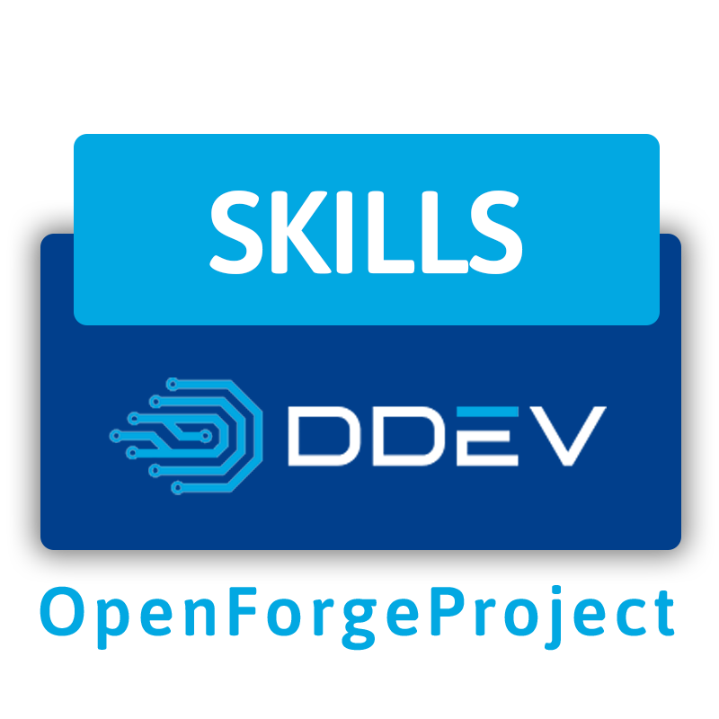

<div style="width: 100%; disply: block; text-align: center;">
    
</div>

[](https://addons.ddev.com)
[](https://github.com/OpenForgeProject/ddev-skills/actions/workflows/tests.yml?query=branch%3Amain)
[](https://github.com/OpenForgeProject/ddev-skills/commits)
[](https://github.com/OpenForgeProject/ddev-skills/releases/latest)

# DDEV Skills

## Overview

This add-on integrates Skills into your [DDEV](https://ddev.com/) project. It allows you to manage and install [skills.sh](https://skills.sh) via a simple configuration file. It reads the skills you want to install from a `.env.skills` file and uses `npx` to install them on your host machine. This add-on is ideal for developers who want to easily manage and update their skills without leaving their DDEV environment.

## Prerequisites

- **Node.js & npm/npx**: This add-on executes commands on your host machine. Ensure you have Node.js and npm installed locally.

## Installation

```bash
ddev add-on get OpenForgeProject/ddev-skills
ddev restart
```

## Configuration

1.  **Create the configuration file**:
    Navigate to your project's `.ddev` directory and create a file named `.env.skills`. You can also copy the sample file provided:

    ```bash
    cp .ddev/.env.skills.sample .ddev/.env.skills
    ```

2.  **Add a skill**:
    Visit skills.sh to find skills you want to install. Each skill has a GitHub repository URL that you will use in the configuration.
    Edit `.ddev/.env.skills` and add the skills you want to install. The format is `SkillName="GitRepoURL"`.

    **Example `.ddev/.env.skills`:**

    ```env
    # Format: Skill-Name="url"
    Skill="https://github.com/username/my-skill-repo"
    AnotherSkill="https://github.com/username/another-skill"
    ```

3.  **Version Control**:
    Make sure to commit the `.ddev/.env.skills` file to version control so your team has the same skills configuration.
    Consider adding `.agents/skills` to your `.gitignore` if you don't want to track installed skills.

## Usage

Run the following command to install or update the skills defined in your configuration:

```bash
ddev skills
```

This command will:
- Read your `.ddev/.env.skills` file.
- Check if `npx` is available.
- Install or update the specified skills using `npx skills`.

## Commands

| Command | Description |
| ------- | ----------- |
| `ddev skills` | Installs or updates skills based on `.ddev/.env.skills` configuration. |

## Credits

**Contributed and maintained by [@OpenForgeProject](https://github.com/OpenForgeProject)**


[](https://addons.ddev.com)
[](https://github.com/OpenForgeProject/ddev-skills/actions/workflows/tests.yml?query=branch%3Amain)
[](https://github.com/OpenForgeProject/ddev-skills/commits)
[](https://github.com/OpenForgeProject/ddev-skills/releases/latest)

# DDEV Skills

## Overview

This add-on integrates Skills into your [DDEV](https://ddev.com/) project. It allows you to manage and install [skills.sh](https://skills.sh) via a simple configuration file. It reads the skills you want to install from a `.env.skills` file and uses `npx` to install them on your host machine. This add-on is ideal for developers who want to easily manage and update their skills without leaving their DDEV environment.

## Prerequisites

- **Node.js & npm/npx**: This add-on executes commands on your host machine. Ensure you have Node.js and npm installed locally.

## Installation

```bash
ddev add-on get OpenForgeProject/ddev-skills
ddev restart
```

## Configuration

1.  **Create the configuration file**:
    Navigate to your project's `.ddev` directory and create a file named `.env.skills`. You can also copy the sample file provided:

    ```bash
    cp .ddev/.env.skills.sample .ddev/.env.skills
    ```

2.  **Add a skill**:
    Visit skills.sh to find skills you want to install. Each skill has a GitHub repository URL that you will use in the configuration.
    Edit `.ddev/.env.skills` and add the skills you want to install. The format is `SkillName="GitRepoURL"`.

    **Example `.ddev/.env.skills`:**

    ```env
    # Format: Skill-Name="url"
    Skill="https://github.com/username/my-skill-repo"
    AnotherSkill="https://github.com/username/another-skill"
    ```

3.  **Version Control**:
    Make sure to commit the `.ddev/.env.skills` file to version control so your team has the same skills configuration.
    Consider adding `.agents/skills` to your `.gitignore` if you don't want to track installed skills.

## Usage

Run the following command to install or update the skills defined in your configuration:

```bash
ddev skills
```

This command will:
- Read your `.ddev/.env.skills` file.
- Check if `npx` is available.
- Install or update the specified skills using `npx skills`.

## Commands

| Command | Description |
| ------- | ----------- |
| `ddev skills` | Installs or updates skills based on `.ddev/.env.skills` configuration. |

## Credits

**Contributed and maintained by [@OpenForgeProject](https://github.com/OpenForgeProject)**
